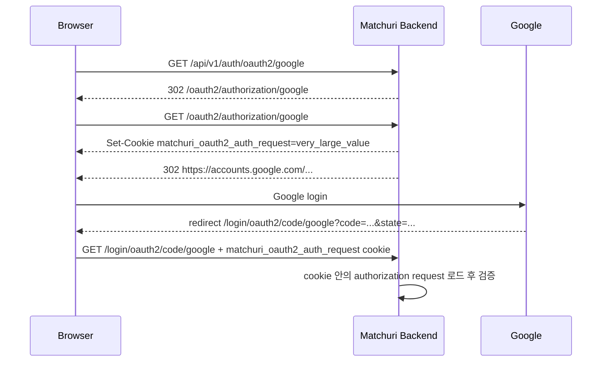
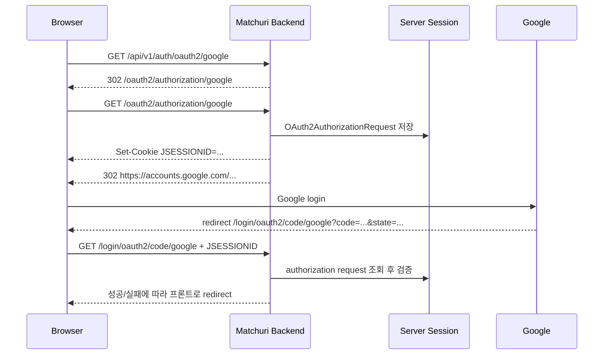

# OAuth2 Authorization Request 저장 구조와 502 장애 대응

## 문서 목적

- Matchuri의 Google OAuth2 시작 흐름이 과거에는 어떤 구조였는지 설명합니다.
- 운영 환경에서 왜 `502 Bad Gateway`가 발생했는지 구조적으로 설명합니다.
- 어떤 기준으로 저장 정책을 바꿨는지와, 현재 구조가 무엇을 의미하는지 남깁니다.
- 이후 기여자가 "왜 세션을 잠깐 쓰는지", "프론트도 바뀌어야 하는지", "멀티 인스턴스에서는 무엇을 다시 봐야 하는지"를 한 번에 이해할 수 있게 합니다.

## 한 줄 요약

- 과거 구조: OAuth2 시작 시 필요한 중간 상태를 브라우저 쿠키에 통째로 저장했습니다.
- 문제: 이 커스텀 쿠키가 너무 커져 `nginx`가 upstream response header를 읽지 못하고 `502`를 반환했습니다.
- 현재 구조: OAuth2 시작~callback 사이의 짧은 중간 상태만 서버 세션에 저장하고, 브라우저에는 작은 세션 식별자만 전달합니다.
- 유지되는 것: 최종 서비스 인증 구조는 여전히 `JWT access token + refresh token cookie`입니다.

## 배경

Matchuri의 Google 로그인은 프론트가 Google SDK를 직접 호출하는 구조가 아니라, 백엔드 리다이렉트 엔드포인트를 통해 시작합니다.

현재 시작점:

- 프론트 버튼 클릭
- `GET /api/v1/auth/oauth2/google`
- 내부적으로 `GET /oauth2/authorization/google`
- Google 인증 화면 이동
- callback: `GET /login/oauth2/code/google`

즉 브라우저는 "Matchuri -> Google -> Matchuri"를 한 번 왕복합니다.
이 왕복 과정에서 서버는 "방금 내가 시작한 요청이 맞는지"를 callback 시점에 다시 검증해야 합니다.

## OAuth2 시작 시 서버가 기억해야 하는 것

OAuth2 시작 요청을 만들 때 서버는 callback 검증을 위해 몇 가지 중간 상태를 보관해야 합니다.

대표 예시:

- `state`
- `nonce`
- PKCE용 `code_verifier`
- `redirect_uri`
- provider 식별 정보

이 정보는 callback 시점에 다시 꺼내 검증해야 하므로, 어디엔가 저장돼야 합니다.

## 기존 구조

### 구조 요약

기존 구현은 `OAuth2AuthorizationRequest` 전체를 Base64 직렬화해 커스텀 쿠키 `matchuri_oauth2_auth_request`에 저장했습니다.

관련 구조:

- `GET /api/v1/auth/oauth2/google`
  - `AuthController`가 `/oauth2/authorization/google`로 리다이렉트
- `/oauth2/authorization/google`
  - Spring Security OAuth2 Client가 authorization request 생성
- `HttpCookieOAuth2AuthorizationRequestRepository`
  - 생성된 authorization request를 커스텀 쿠키에 저장

### 요청 흐름



### 왜 이런 구현을 썼는가

이 방식의 장점은 서버가 OAuth2 시작 상태를 별도 저장소에 보관하지 않아도 된다는 점이었습니다.
즉 "중간 상태도 브라우저가 들고 다니게" 해서, API 서버가 상태 없는 흐름처럼 보이게 만들 수 있었습니다.

소규모 서비스에서 빠르게 붙이기에는 단순한 선택이지만, 응답 헤더 크기 문제에 취약했습니다.

## 기존 구조의 문제점

### 1. 응답 헤더가 너무 커질 수 있었습니다

`OAuth2AuthorizationRequest` 안에는 단순 provider 이름만 있는 것이 아니라, 검증에 필요한 여러 값이 함께 들어갑니다.
이 객체를 통째로 직렬화해 쿠키로 내려보내면 `Set-Cookie` 헤더가 커질 수밖에 없습니다.

운영 환경에서는 `/oauth2/authorization/google` 응답이 아래 두 종류의 큰 헤더를 동시에 포함했습니다.

- 큰 `Set-Cookie`
- Google로 보내는 긴 `Location`

### 2. Nginx가 upstream response header를 읽지 못했습니다

운영 Nginx 에러 로그에서 아래 메시지가 반복적으로 확인됐습니다.

```text
upstream sent too big header while reading response header from upstream
```

이 의미는:

- `nginx`는 살아 있음
- upstream인 Spring Boot도 완전히 죽은 것은 아님
- 다만 `/oauth2/authorization/google` 응답 헤더가 너무 커서 `nginx`가 이를 받아 전달하지 못함
- 결과적으로 사용자에게는 `502 Bad Gateway`가 보임

즉 이번 장애는 Google 자체 문제도, 프론트 문제도 아니라, "백엔드가 OAuth2 시작 응답에 너무 큰 헤더를 싣는 구조"의 문제였습니다.

### 3. 브라우저가 불필요하게 큰 중간 상태를 들고 다녔습니다

이 구조에서는 브라우저가 실제 필요한 것보다 더 큰 중간 상태를 쿠키로 보관하고 callback 시점에 다시 전송합니다.
서비스 본인 인증이 아닌 "잠깐 필요한 내부 검증 상태"를 클라이언트 왕복 데이터로 밀어 넣는 셈이라, 운영 안정성 면에서 불리했습니다.

## 해결 과정

### 1. 장애 재현과 원인 좁히기

아래 관찰이 핵심이었습니다.

- `GET /api/v1/health`는 정상 응답
- `GET /oauth2/authorization/google`만 `502`
- Nginx error log에 `upstream sent too big header...`
- 기존 구현에 커스텀 OAuth2 authorization request 쿠키 저장 로직이 존재

이 네 가지를 연결하면 원인은 "OAuth2 authorization request cookie로 인한 oversized response header"로 좁혀졌습니다.

### 2. 저장 위치 정책 변경

문제의 본질은 "중간 상태를 어디에 저장하느냐"였기 때문에, 임시로 `nginx` 버퍼만 키우는 대신 저장 정책 자체를 바꿨습니다.

바뀐 정책:

- 커스텀 쿠키에 OAuth2 authorization request 전체를 저장하지 않는다
- 서버 세션에 authorization request를 저장한다
- 브라우저에는 세션 식별자만 전달한다

### 3. 구현 변경

핵심 변경점:

- `HttpCookieOAuth2AuthorizationRequestRepository` 제거
- `MatchuriOAuth2AuthorizationRequestRepository` 추가
- 내부적으로 `HttpSessionOAuth2AuthorizationRequestRepository` 사용
- OAuth2 성공/실패 핸들러에서 authorization request 정리 로직을 새 저장소 기준으로 갱신

관련 코드:

- `backend/src/main/java/matchuri/backend/global/security/MatchuriOAuth2AuthorizationRequestRepository.java`
- `backend/src/main/java/matchuri/backend/global/config/SecurityConfig.java`
- `backend/src/main/java/matchuri/backend/global/security/OAuth2AuthenticationSuccessHandler.java`
- `backend/src/main/java/matchuri/backend/global/security/OAuth2AuthenticationFailureHandler.java`

### 4. 검증

- 단위 테스트로 authorization request가 서버 세션에 저장/정리되는지 검증
- 통합 테스트로 OAuth2 authorization endpoint가 더 이상 `matchuri_oauth2_auth_request` 쿠키를 만들지 않는지 검증
- `./gradlew test` 전체 통과 확인
- 운영 배포 후 실제 Google 로그인 시작 정상 동작 확인

## 현재 구조

### 구조 요약

현재는 OAuth2 시작~callback 사이의 짧은 중간 상태만 서버 세션에 저장합니다.
브라우저는 큰 커스텀 쿠키 대신 세션 식별자만 들고 다닙니다.

### 요청 흐름



### 현재 구조의 핵심 성격

- 서비스 전체가 세션 로그인으로 바뀐 것은 아닙니다.
- OAuth2 handshake 구간만 잠깐 stateful해졌습니다.
- 로그인 완료 이후 Matchuri의 서비스 인증은 여전히 JWT 기반입니다.

정리하면:

- OAuth2 중간 상태: 서버 세션
- 서비스 인증: `access token + refresh token cookie`

## 프론트엔드 영향

### 직접적인 프론트 코드 변경은 거의 없습니다

프론트는 여전히 같은 시작 URL로 이동하면 됩니다.

예시:

- `https://api.matchuri.com/api/v1/auth/oauth2/google`

변한 것은 "중간 상태가 브라우저 내부 커스텀 쿠키에 있느냐" vs "서버 세션에 있느냐"이지, 프론트가 호출하는 시작 엔드포인트나 성공/실패 복귀 계약은 아닙니다.

### 프론트가 간접적으로 알아둘 점

- 브라우저에는 `api.matchuri.com` 기준의 세션 식별 쿠키가 일시적으로 사용될 수 있습니다.
- 프론트 JS가 이 값을 직접 읽거나 관리할 필요는 없습니다.
- 브라우저 리다이렉트 기반 로그인 흐름에서는 보통 자동 처리됩니다.

## 현재 구조의 장점

### 1. 이번 502 원인을 직접 제거합니다

- 큰 `Set-Cookie` 헤더가 사라집니다.
- `/oauth2/authorization/google` 응답 헤더 크기가 작아집니다.
- `nginx` response header 한계에 걸릴 가능성이 크게 줄어듭니다.

### 2. 중간 상태 저장 책임이 더 명확해집니다

- callback 검증용 내부 상태는 서버가 보관합니다.
- 브라우저는 식별자만 들고 다닙니다.
- "내부 검증용 임시 상태"를 클라이언트가 통째로 운반하는 구조보다 운영 안정성이 높습니다.

### 3. 현재 팀/인프라 규모에 잘 맞습니다

- 현재 Matchuri는 단일 EC2 기반 운영입니다.
- 단일 인스턴스에서는 세션 저장에 따른 운영 복잡도가 낮습니다.
- 2인 팀 기준으로도 감당 가능한 단순한 선택입니다.

## 현재 구조의 trade-off와 추후 주의점

### 1. 멀티 인스턴스 확장 시 세션 공유 전략이 필요합니다

현재는 단일 EC2라 문제가 없지만, 나중에 서버가 여러 대가 되면 아래 상황이 생길 수 있습니다.

- OAuth2 시작 요청은 서버 A가 처리
- callback은 서버 B가 처리

이때 B가 A의 세션을 못 보면 callback 검증에 실패할 수 있습니다.

추후 확장 시 선택지:

- sticky session
- shared session store (`Spring Session + Redis` 등)

### 2. 서버 재시작 중에는 OAuth2 중간 상태가 유실될 수 있습니다

사용자가 Google 로그인 화면에 머무는 사이 서버가 재시작되면 세션이 사라질 수 있습니다.
그 경우 callback 시 로그인 실패가 발생할 수 있습니다.

다만 현재 구조에서는 "다시 로그인 시도하면 복구 가능한 일시적 실패" 성격이 강합니다.

### 3. `SessionCreationPolicy.STATELESS`와 완전히 같은 철학은 아닙니다

현재 API 인증 철학은 여전히 stateless JWT 기반입니다.
다만 OAuth2는 callback 검증용 임시 상태가 꼭 필요하므로, 이 구간만 선택적으로 stateful하게 운영합니다.

이건 "정책 모순"이라기보다 OAuth2 handshake가 요구하는 현실적인 절충입니다.

## 현재 기준 결론

- Matchuri의 최종 서비스 인증 구조는 여전히 토큰 기반입니다.
- OAuth2 시작~callback 사이의 임시 상태만 서버 세션을 사용합니다.
- 이 결정은 운영 `502`의 직접 원인을 제거하기 위한 근본 수정입니다.
- 단일 EC2 운영 기준에서는 현재 팀이 감당 가능한 단순성과 안정성의 균형이 좋은 선택입니다.
- 추후 다중 인스턴스 운영으로 확장되면 세션 공유 전략만 추가로 재검토하면 됩니다.

## 관련 문서

- `docs/api/auth-google-oauth2.md`
- 내부 운영 문서
- `docs/backend/security.md`
- 내부 실행 계획 기록
